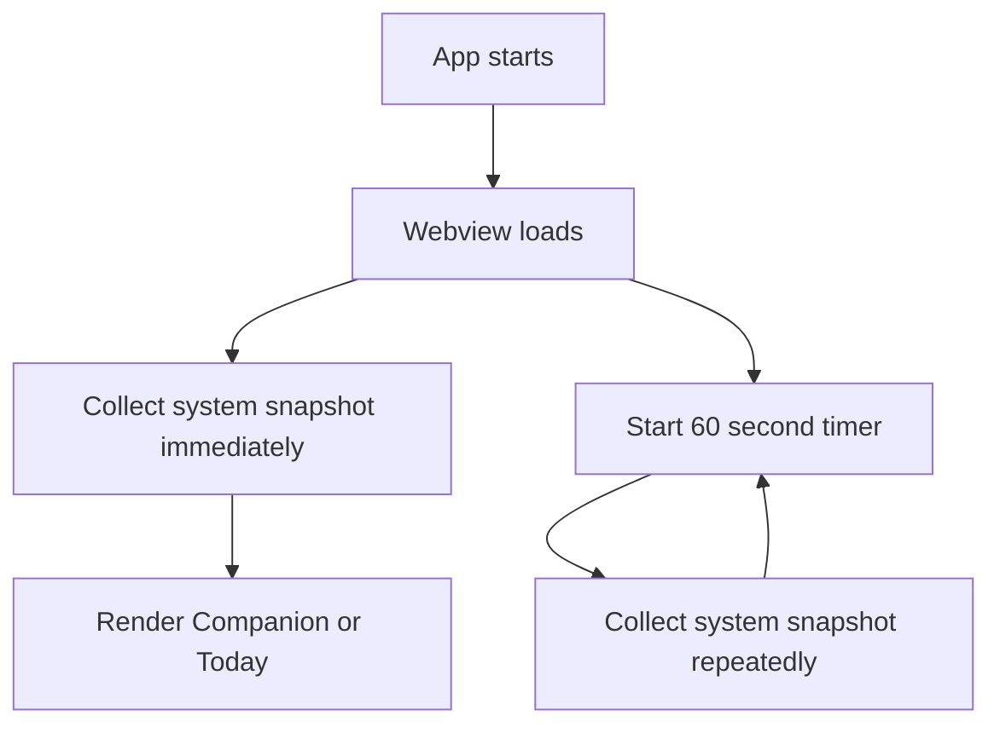
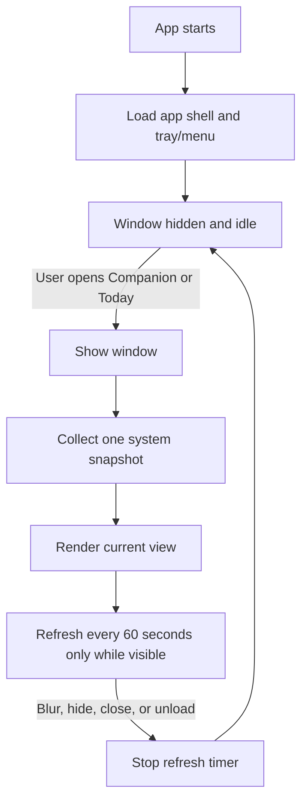

# Low Compute Audit and Reduction Report

Date: 2026-07-05

Standard: `docs/Engineering-Standards/001-Low-Compute-Architecture.md`

## Executive Summary

System Pulse already has a low-compute marketing website: it is static HTML/CSS served by a tiny local Python server for Replit preview. It does not load analytics, AI, realtime services, Supabase, dashboards, or background jobs.

The main ongoing compute risk was in the desktop app. The Tauri frontend loaded a full local system snapshot immediately and started a 60 second refresh loop as soon as the webview loaded. That snapshot is useful while Vanessa is looking at System Pulse, but it should not run while the app is idle.

This pass changes the desktop architecture so System Pulse sleeps until the user opens it.

## Audit Report

| Location | Purpose | Frequency Before | Estimated Impact | Recommendation / Status |
| --- | --- | --- | --- | --- |
| `app/desktop/src/main.ts` | Initial `loadToday()` collected a local system snapshot on frontend load. | Once per app webview load. | Medium. It triggered several local system commands before the user asked for a check-in. | Removed. The app now waits until the user opens Companion, opens Today, or refreshes. |
| `app/desktop/src/main.ts` | `setInterval` refreshed the full system snapshot. | Every 60 seconds after frontend load. | Medium to high. Each snapshot includes process, memory, storage, CPU, swap, and disk activity checks. | Scoped to visible active use. The timer starts only while the window is shown and stops on blur, hidden, or unload. |
| `app/desktop/src/main.ts` | Focus and visibility handlers refreshed the system snapshot. | Every focus or visibility return. | Medium. Useful when the user returns, but should not run while hidden. | Kept, but visibility now also stops the timer when hidden. |
| `app/desktop/src-tauri/src/collectors/macos.rs` | Collects local macOS signals for PulseCore. | Previously startup plus every 60 seconds while frontend existed. | High when repeated unnecessarily. It shells out to `top`, `sysctl`, `vm_stat`, `df`, `iostat`, and `ps`. | Kept because behavior depends on these signals, but now called only for user-visible checks. Future work can reduce `iostat` sampling cost. |
| `app/desktop/src-tauri/src/main.rs` | Tauri commands, tray, menu, window display. | Startup plus user actions. | Low. Tray/menu setup is lightweight. | Compliant. Startup exposes entry points only. |
| `app/desktop/src-tauri/src/main.rs` | Care actions such as restarting a browser or opening storage settings. | User action only. | Low and intentional. | Compliant. No automatic care action runs. |
| `website/index.html` | Marketing landing page content. | Browser request only. | Very low. Static HTML. | Compliant. |
| `website/styles.css` and `website/hero-image.css` | Website styling and responsive layout. | Browser render only. | Low client-side render cost. | Compliant. |
| `website/server.py` | Replit preview static file server. | One request at a time. | Very low. No background workers. | Compliant. |
| `.github/workflows/desktop-build.yml` | Builds downloadable desktop artifacts. | Manual dispatch and relevant pushes. | GitHub-hosted compute only, not runtime compute. | Compliant. No scheduled runs. |
| `.github/workflows/macos-certified-release.yml` | Builds signed/notarized release DMG. | Manual dispatch and release event. | GitHub-hosted release compute only. | Compliant. No scheduled runs. |
| `.github/workflows/macos-signed-release.yml` | Legacy/manual signed release workflow. | Manual dispatch only. | GitHub-hosted release compute only. | Compliant. |
| Supabase, OpenAI, websocket, realtime, analytics, telemetry | Not found in this repository. | Not applicable. | None. | Compliant. Keep this true unless a future feature explicitly requires it. |

## Refactored Code

Changed:

- `app/desktop/src-tauri/tauri.conf.json`
- `app/desktop/src/main.ts`

The Tauri main window now starts hidden. The frontend no longer loads the system snapshot or starts the refresh timer at module load.

The refresh loop is now tied to visible user use:

- starts when Companion or Today is opened
- starts on explicit refresh
- refreshes once when a visible window regains focus
- stops on blur
- stops when hidden
- stops before unload

## Before Architecture

## After Architecture

## Compute Reduction Report

Before this change, zero active users could still cause:

- one system snapshot on app/webview launch
- one repeated snapshot every 60 seconds while the webview remained alive

After this change, zero active users cause:

- no system snapshot on launch
- no refresh timer while the window is hidden
- no polling while the user is not looking at System Pulse

Active use remains intentionally useful:

- when Vanessa opens System Pulse, it checks local health once
- while the window is visible, it refreshes every 60 seconds
- when the window is hidden or blurred, the refresh loop stops

Expected reduction for idle desktop runtime:

- Startup collection: reduced from 1 snapshot to 0 snapshots
- Idle polling: reduced from 1 snapshot per minute to 0 snapshots per minute
- Idle AI/realtime/database/analytics: already 0, remains 0

## Behaviour Preservation

User-facing behaviour is preserved for active use:

- Companion still opens from the tray/menu entry point
- Today still opens from the tray/menu entry point
- manual refresh still works
- care actions still require explicit user action
- website and download links continue to work as before

The only intentional architecture change is that System Pulse now waits quietly until the user opens it.

## Future Recommendations

1. Replace shell-based macOS collection with lower-overhead native APIs where practical.
2. Consider collecting disk activity only when memory, CPU, or storage signals suggest it could matter.
3. Keep the marketing site static unless a feature has a clear user-visible need.
4. If accounts, analytics, or AI are added later, load them only after user navigation and explicit consent.
5. Add a lightweight CI check that rejects new unscoped `setInterval`, websocket, analytics, or scheduled workflow additions unless documented.
