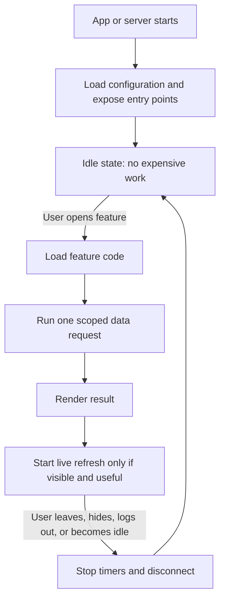

# Engineering Standard 001

# Low Compute Architecture

Status: Active

Applies to: System Pulse and every Abundant Freedom application.

## Objective

A deployed application with zero active users should consume close to zero compute.

This is a non-functional requirement equal in importance to security, reliability, and maintainability.

## Rule

Applications must sleep by default.

Only user-visible, user-requested, or explicitly scheduled work should run. Anonymous visitors, idle clients, hidden windows, and signed-out sessions must not trigger expensive services.

## Startup Standard

Startup may only:

- load configuration
- initialise the web server or app shell
- initialise authentication
- expose routes, menus, or entry points

Startup must not:

- calculate reports
- collect system snapshots
- connect realtime services
- start polling
- initialise AI
- download datasets
- build dashboards
- preload user data
- preload admin data

## Landing Page Standard

The landing page should be almost entirely static.

It must not load:

- dashboards
- analytics
- AI
- reporting
- trading engines
- admin interfaces
- realtime services

Those features may load only after the user navigates to them.

## Authentication Standard

Authenticated services initialise only after successful login.

Anonymous visitors may receive only:

- landing page
- pricing
- marketing
- documentation
- login
- signup

## Lazy Loading Standard

Every expensive feature must be lazy-loaded.

Examples:

- AI
- reporting
- charting
- exports
- PDF generation
- analytics
- admin
- dashboards

## Realtime Standard

Realtime services must only exist while required.

Disconnect immediately when:

- leaving the page
- logging out
- closing the browser
- hiding or closing the app window
- inactivity makes the live connection unnecessary

## Polling Standard

Polling is a last resort.

Prefer:

- webhooks
- event-driven architecture
- user actions
- realtime events scoped to visible active sessions

If polling is required, it must:

- be documented
- have the lowest practical frequency
- stop when the user leaves the relevant screen
- stop when the app is hidden or idle

## AI Standard

AI must never execute automatically.

AI may run only when:

- the user requests it
- a scheduled automation explicitly requires it
- an administrator requests it

## Database Standard

Database usage should be scoped and cache-aware.

Avoid:

- repeated queries
- unnecessary listeners
- duplicate authentication lookups
- polling

Use caching when it reduces repeated reads without creating stale or misleading user experience.

## Frontend Standard

Split bundles by feature.

Landing page downloads only landing page code.

Dashboard downloads only dashboard code.

Admin downloads only admin code.

AI downloads only AI code.

## Idle Standard

When no users are connected or no user-facing app window is active:

- no timers
- no polling
- no AI
- no websocket connections
- no analytics
- no unnecessary compute

The application should effectively sleep.

## System Pulse Application Pattern

System Pulse is a local-first macOS app, so the standard maps slightly differently from a server application.

Before:

- the frontend loaded a system snapshot as soon as the app webview loaded
- the frontend started a 60 second refresh timer immediately
- the snapshot collection ran local system commands even when the user had not opened the app window

After:

- the Tauri window starts hidden
- the app shell starts with tray/menu entry points only
- no system snapshot is collected on launch
- no timer starts while the app is hidden
- a snapshot is collected only when the user opens Companion, opens Today, or explicitly refreshes
- the refresh timer runs only while the window is visible/focused
- the timer stops when the window is hidden, blurred, or unloaded

## Reusable Pattern

Use this pattern for all future active features:

## Future Development Checklist

Before merging new work, confirm:

- Does startup still avoid expensive work?
- Does the landing page remain static or near-static?
- Does anonymous traffic avoid dashboard/admin/AI code?
- Does every timer stop on page leave or app hide?
- Does every realtime connection disconnect when no longer needed?
- Does AI run only after a user or explicit automation requests it?
- Does the code avoid duplicate database reads and auth lookups?
- Does the feature have a documented reason if polling remains?

## Related Report

The System Pulse audit and compute reduction report is recorded in:

- `docs/40-Low-Compute-Audit-And-Reduction.md`
